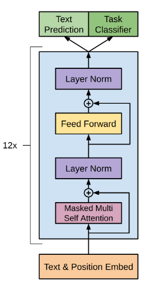
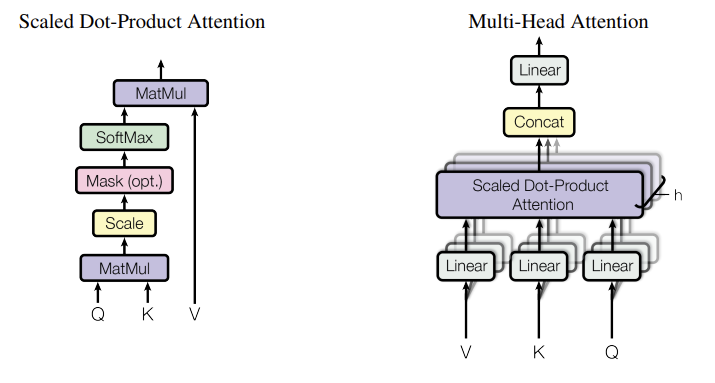
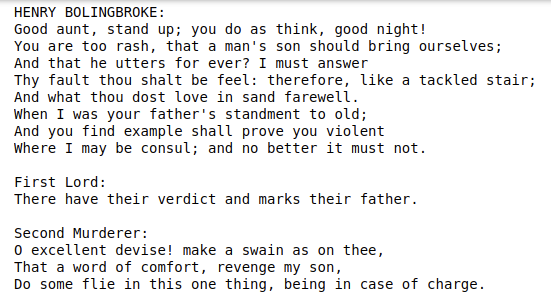

# Generative Pretrained Transformers (GPT)

**Language Models are Few-Shot Learners** [[PAPER]](https://arxiv.org/pdf/2005.14165.pdf) [[OpenAI Blog]](https://openai.com/blog/gpt-3-apps/)

A minimal Pytorch implementation of OpenAI's GPT (Generative Pretrained Transformer). GPT is a decorder only model which is based on the original transformer model (Vaswani, et al. _"Attention Is All You Need"_). This repository implements a simple version of GPT-3. The code is written as clearly as possible so that it is easy to understand.

## Brief Explanation of Architecture

<p align="center" >
    
</p>

The GPT model is composed of a bunch of layers stacked on top of each other. Each layer can be thought of as a transformer block. The transformer block is itself made up by few components, Masked Multi Head Self Attention Layer, Point Wise Feed Forward Layer, and Layer Norms.

Inputs to the transformers are first passed through an Embedding layer which is learnable. Because the transformers are position invariant, meaning transfomers does not maintain the order of words in input data, we need to add the positional encodings to our embedded data to introduce ordering in inputs.

### Masked Multi Head Self Attention

The inputs are first passed to this layer. The inputs are split into key, query and value pairs. Key, query and values are linearly projected using a MLP layer. Key and Queries are multiplied and scaled to generate the attention scores. This attention score is then multiplied with the value followed by a linear projection to generate output.

<p align="center">
    
</p>

To increase capactiy of the model, we use multiple of such scaled attention heads. The output from all the heads are concatenated and projected to form output of this layer.

Since GPT is a decoder only transformer, a mask is used to prevent the model from attending to future tokens. The model is only allowed to attend to the current token and all the previous tokens. This prevents the model from "cheating".

The code for this layer is given below :

```python
class SelfAttention(nn.Module):
    def __init__(self, config: GPTconfig) -> None:
        super(SelfAttention, self).__init__()

        self.embd_size = config.embd_size
        self.n_heads = config.n_heads

        assert self.embd_size % self.n_heads == 0, f"d_model({config.embd_size}) must be divisible by n_heads({config.n_heads})."

        self.key = nn.Linear(config.embd_size, config.embd_size)
        self.query = nn.Linear(config.embd_size, config.embd_size)
        self.value = nn.Linear(config.embd_size, config.embd_size)

        self.projection = nn.Linear(config.embd_size, config.embd_size)

        self.attn_drop = nn.Dropout(config.attn_drop)
        self.resid_drop = nn.Dropout(config.resid_drop)

        self.register_buffer("mask", torch.tril(torch.ones(config.block_size, config.block_size)).view(1,1,config.block_size, config.block_size))


    def forward(self, x) -> torch.Tensor:
        B,T,C = x.size()

        # shape of k,q,v would be (batch_size, n_heads, block_size, hs)
        k = self.key(x).view(B, T, self.n_heads, C // self.n_heads).transpose(1,2)
        q = self.query(x).view(B, T, self.n_heads, C // self.n_heads).transpose(1,2)
        v = self.value(x).view(B, T, self.n_heads, C // self.n_heads).transpose(1,2)

        # (batch_size, n_heads, block_size, hs) x (batch_size, n_heads, hs, block_size) -> (batch_size, n_heads, block_size, block_size)
        attn = (q @ k.transpose(2,3)) / sqrt(k.size(-1))
        attn = attn.masked_fill(self.mask[:,:,:T,:T] == 0, float('-inf'))
        attn = F.softmax(attn, dim=-1)
        attn = self.attn_drop(attn)

        # (batch_size, n_heads, block_size, block_size) x (batch_size, n_heads, block_size, hs) -> (batch_size, n_heads, block_size, hs)
        y = attn @ v
        y = y.transpose(1,2).contiguous().view(B, T, C)

        y = self.projection(y)
        y = self.resid_drop(y)

        return y
```

### Point Wise Feed Forward Layer

This layer takes in the normalized output of the self attention layer. It performs a linear projection over the inputs to form a larger hidden representation and then projection back to the original dimensions.

The GPT models use an expansion rate of 4 times the input dimensions. The output of this layer is then passed through a LayerNorm. GELU activation is used with the output of first projection. Optionally, dropout is used on the output of the layer.

Code for this layer is given below :

```python
class PointWiseFeedForward(nn.Module):

    def __init__(self, config: GPTconfig) -> None:
        super().__init__()

        self.mlp = nn.Sequential(
                                nn.Linear(config.embd_size, config.embd_size * 4),
                                nn.GELU(),
                                nn.Linear(config.embd_size * 4, config.embd_size),
                                nn.Dropout(config.resid_drop)
                                )

    def forward(self, x):
        return self.mlp(x)
```

### Transformer Block

Using the above two layers, we can now form the transformer block. Each of the above two layers is referred to as a sublayer. Residual connections (He, et al. _"Deep Residual Learning for Image Recognition"_) are employed in between the sublayers. LayerNorm is used for normalization.

Code for the transformer block is given below :

```python
class Block(nn.Module):

    def __init__(self, config: GPTconfig) -> None:
        super().__init__()

        self.attn = SelfAttention(config)

        self.ln1 = nn.LayerNorm(config.embd_size)
        self.ln2 = nn.LayerNorm(config.embd_size)

        self.mlp = PointWiseFeedForward(config)

    def forward(self, x) -> torch.Tensor:
        x = self.ln1(x + self.attn(x))
        x = self.ln2(x + self.mlp(x))
        return x
```

This block is now repeated `N` times to form the complete GPT model.

## Notes on GPT variants

#### GPT-1

**Improving Language Understanding by Generative Pre-Training**

[[PAPER]](https://s3-us-west-2.amazonaws.com/openai-assets/research-covers/language-unsupervised/language_understanding_paper.pdf)

- The above explained architecture is used in GPT-1.
- GPT-1 used 12 decoder only layers with 12 attention heads and an embedding size of 768 dimensions.
- For the position wise feed-forward layer, 3072 internal dimensions were used.
- Adam was used to optimize with a max lr of 2.5e-4
- LR decay was used. Initially increased linearly from 0 to first 2000 updates and decayed to 0 using cosine lr scheduler.
- Model was trained for 100 epochs with a batch size of 64 and a sequence of 512 tokens.
- Weight Initialization of N(0, 0.02) was used.
- BPE vocabulary with 40k merges.
- Dropout of 0.1 was used on residual, embeddings and attention dropout layers
- Gaussian Error Linear Unit was used as an activation function
- Learned position embeddings were used instead of sinusoidal embeddings as proposed in original transformer paper.
- GPT-1 model has ~117M parameters

#### GPT-2

**Language Models are Unsupervised Multitask Learners**

[[PAPER]](https://d4mucfpksywv.cloudfront.net/better-language-models/language_models_are_unsupervised_multitask_learners.pdf)

- Noticable change in GPT-2 compared to GPT-1 was that LayerNorm layer was moved to the input of sublayers. This is similar to pre-activation residual networks
- additional layer norm was added after the final block
- modified initialization which accounts for the accumulation on the residual path with model depth is used.
- vocabulary is expanded to 50,257
- context size is increased to 1024 tokens from 512
- batch size of 512 is used
- GPT-2 has 48 layers with an embedding size of 1600
- ~1.5 Billion trainable parameters

#### GPT-3

**Language Models are Few-Shot Learners**

[[PAPER]](https://arxiv.org/pdf/2005.14165.pdf)

- GPT-3 has 96 layers, 96 heads, and embedding size of 12288
- GPT-3 also has a GPT-1 like model with 12 layers, 12 heads, and 768 embedding size which totals to 125M parameters.
- Same architecture as GPT-2 is used.
- we always have the feedforward layer four times the size of the bottleneck layer, dff = 4 ∗ embedding_size
- context size of 2048 tokens
- batch size of 1024
- Adam with β1 = 0.9, β2 = 0.95, and eps = 10−8
- global norm of the gradient was clipped at 1.0
- Linear LR warmup over the first 375 million tokens. Then use cosine decay for learning rate down to 10% of its value, over 260 billion tokens.
- gradually increase the batch size linearly from a small value (32k tokens) to the full value over the first 4-12 billion tokens of training, depending on the model size.
- full 2048-sized time context window is always used, with a special END OF DOCUMENT token delimiter
- GPT-3 has approximately 175 Billion Parameters.

## Requirements

1. PyTorch
2. Numpy
3. Tqdm

## Setup

- Download the mentioned requirements in a conda env.
- Use the existing datasets in `data/` directory for training.
- You can add your own text datasets to `data/` directory.

## Training

- Use the `TrainingConfig` to setup your training environment.
- By default, the trainer will train on CPU if the system does not have GPU(s).
- If GPU(s) are present, all the available GPU(s) are used for training.
- Override GPU training by setting the `device` arg in `TrainingConfig` to `cpu` (eg. `TrainingConfig(..., device="cpu")`).
- Mention the `ckpt_path` for model saving (eg. `TrainingConfig(..., ckpt_path="./checkpoints/transformers.pt")`).
- Set other training parameters such as `max_epochs, batch_size, lr, betas, lr_decay, ckpt_path, device`.
- Refer to `gpt/trainer.py` for additional configuration parameters.

## Poem Generation using GPT

<p align="center">
    <!--  -->
    
</p>

GPT can be used for language modelling tasks such as poem generation. Refer to the `PoemGeneration.ipynb` notebook. The notebook goes into details of how to generate shakespearian poems using GPT character by character.

## License

MIT
